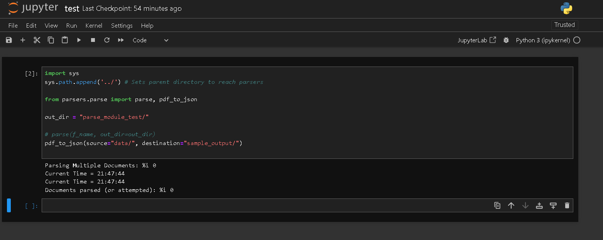
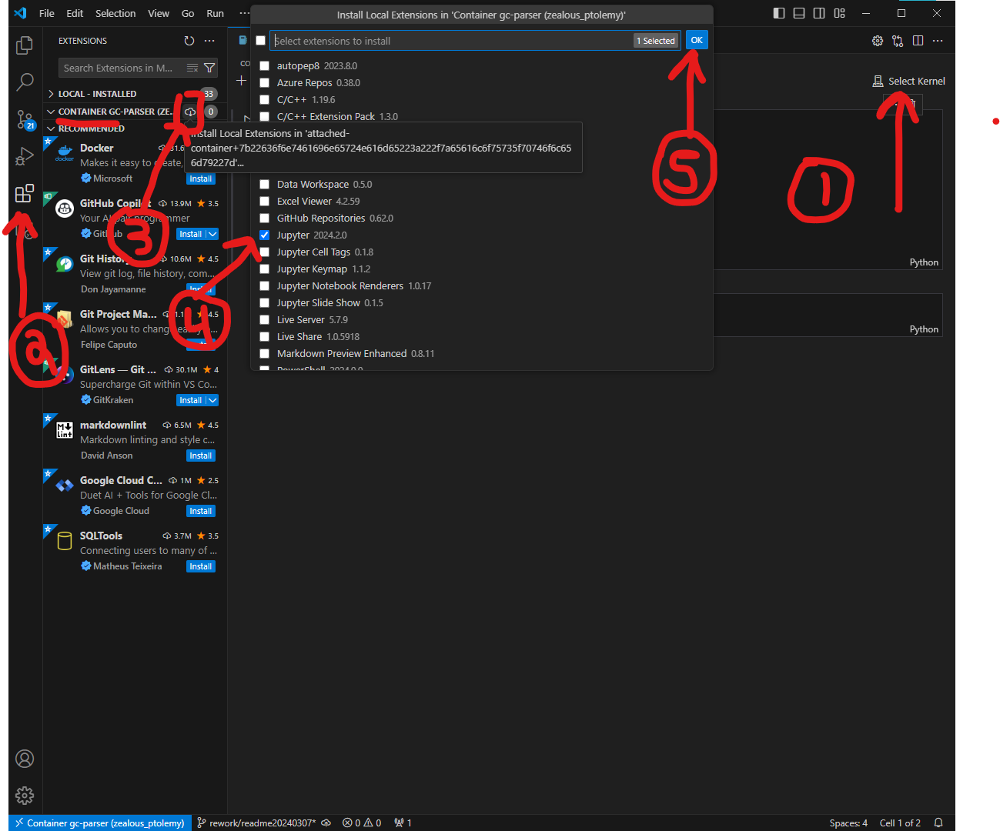

# README

## Quick Start
If the Docker image `gc-parser` is already built, start the container with this command:

```shell
./start.sh
```

To find the running container's ID, use:

```shell
docker ps
```

To stop the container, execute:

```shell
docker stop <CONTAINER_ID>
```

Replace `<CONTAINER_ID>` with the actual ID of your container.

## Initial Setup
Steps have been tested and designed using bash

### Requirements
- Visual Studio Code (VS Code)
- Bash

### Default Values
- `CONTAINER_NAME=gc-parser`
- `IMAGE_NAME=gc-parser`
- `PORT=8888:8888`

Modify `./setupDockerEnv.sh` to adjust default values.

## Run 
`config/dockerConf/setupDockerEnv.sh` from the root of the repo to download required dependencies and map the container's port to `PORT` value.

`config/dockerConf/start.sh` to start container

After container and image setup, a log will provide access URLs:


Copy and paste the second URL (http://127.0.0.1:8888/) into your browser to begin testing using Jupyter Lab.
Password is `gamechanger`

## Additional Steps for VS Code Development

1. Navigate to `example.ipynb` in your browser to initialize the kernel. No import errors should occur:

   
   If Import errors do Occur at this step, try turning kernel on.
   Top right `Python 3 (ipykernel)` button <br><br>

2. In VS Code, connect to your running container:
   - Click the blue icon at the bottom left.
   - Select "Attach to running container".
   - Choose `gc-parser` (default).

If the app's directory isn't visible, open a terminal in VS Code (attached to the container) and execute:

```shell
cd /home
code .
```

New IDE will open, and look like this:


3. In VS Code, reopen `example.ipynb`:
   - Choose the kernel at the top right of the notebook.
   - If prompted, install the Jupyter Extension:

     

   - Select "Existing Kernel" and the url  `http://127.0.0.1:8888` \
      password is `gamechanger`
   - Name your server and select `ipykernel` kernel.

You're now set to execute the notebook in your container through VS Code, automatically syncing your Jupyter Labs environment.

# Known Issues
1. ERROR: failed to solve: ubuntu:20.04: error getting credentials - err: exec: "docker-credential-desktop": executable file not found in %PATH%, out: ``
Docker build failed

https://stackoverflow.com/questions/71770693/error-saving-credentials-error-storing-credentials-err-exit-status-1-out

Run
```shell
service docker stop
rm ~/.docker/config.json
service docker start
```

2. Open jupyter tabs or jupyter files in vs-code will spam server with requests that will fail (403 GET) if the server has been stopped and started \
eg `[W 2024-03-06 19:39:33.516 ServerApp] 403 GET /api/sessions?1709753973500 (@192.168.65.1) 0.93ms referer=None` \
To fix, close old browser tabs \
or unfortunately, close and reopen vs-code since there doesn't seem to be a way to stop it from trying to connect to a kernel

current workaround in ./start.sh
```shell
docker run -p 8888:8888 -v $(pwd):/home/ gc-parser 2>&1 | awk '/Use Control-C to stop this server and shut down all kernels \(twice to skip confirmation\)\./{exit}1' #Stops logging once links have been provided
```